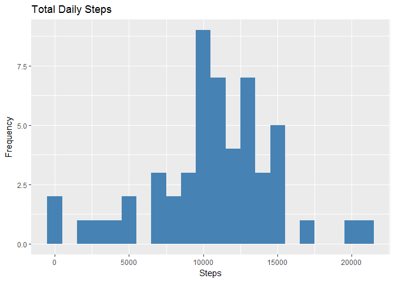

# Reproducible Research: Peer Assessment 1


## Loading and preprocessing the data


```r
library(ggplot2)
unzip(zipfile="activity.zip")
activity_data <- read.csv("activity.csv")
head(activity_data)
```

```
##   steps       date interval
## 1    NA 2012-10-01        0
## 2    NA 2012-10-01        5
## 3    NA 2012-10-01       10
## 4    NA 2012-10-01       15
## 5    NA 2012-10-01       20
## 6    NA 2012-10-01       25
```

```r
dim(activity_data)
```

```
## [1] 17568     3
```

```r
summary(activity_data)
```

```
##      steps                date          interval     
##  Min.   :  0.00   2012-10-01:  288   Min.   :   0.0  
##  1st Qu.:  0.00   2012-10-02:  288   1st Qu.: 588.8  
##  Median :  0.00   2012-10-03:  288   Median :1177.5  
##  Mean   : 37.38   2012-10-04:  288   Mean   :1177.5  
##  3rd Qu.: 12.00   2012-10-05:  288   3rd Qu.:1766.2  
##  Max.   :806.00   2012-10-06:  288   Max.   :2355.0  
##  NA's   :2304     (Other)   :15840
```

## What is mean total number of steps taken per day?

1. Calculate the total number of steps taken per day

```r
total_steps <- aggregate(activity_data$steps, by=list(activity_data$date), sum)
names(total_steps)[1] ="date"
names(total_steps)[2] ="totalsteps"
head(total_steps)
```

```
##         date totalsteps
## 1 2012-10-01         NA
## 2 2012-10-02        126
## 3 2012-10-03      11352
## 4 2012-10-04      12116
## 5 2012-10-05      13294
## 6 2012-10-06      15420
```

2. Make a histogram of the total number of steps taken each day


```r
ggplot(total_steps, aes(x = total_steps$totalsteps)) +
  geom_histogram(fill = "steelblue", binwidth=1000) +
  labs(title = "Total Daily Steps", x = "Steps", y = "Frequency")
```

```
## Warning: Removed 8 rows containing non-finite values (stat_bin).
```

<!-- -->

3. Calculate and report the mean and median of the total number of steps taken per day


```r
mean(total_steps$totalsteps, na.rm=TRUE)
```

```
## [1] 10766.19
```

```r
median(total_steps$totalsteps, na.rm=TRUE)
```

```
## [1] 10765
```

## What is the average daily activity pattern?

1. Time series plot of the average number of steps taken


```r
averages <- aggregate(x=list(steps=activity_data$steps), by=list(interval=activity_data$interval),
                      FUN=mean, na.rm=TRUE)
ggplot(data=averages, aes(x=interval, y=steps)) +
    geom_line(color="steelblue") +
    xlab("5-minute Interval") +
    ylab("Average Number of Steps Taken")
```

<!-- -->

2. Which 5-minute interval, on average across all the days in the dataset, contains the maximum number of steps?

On average across all the days in the dataset, the 5-minute interval contains the maximum number of steps?


```r
max_steps <- averages[which.max(averages$steps),]
max_steps
```

```
##     interval    steps
## 104      835 206.1698
```

## Imputing missing values

There are many days/intervals where there are missing values (coded as `NA`). The presence of missing days may introduce bias into some calculations or summaries of the data.

1. Calculate and report the total number of missing values in the dataset (i.e. the total number of rows with NAs)


```r
missing_count <- is.na(activity_data$steps)
table(missing_count)
```

```
## missing_count
## FALSE  TRUE 
## 15264  2304
```

2. Devise a strategy for filling in all of the missing values in the dataset.

`Strategy`: Use mean interval steps from Mean Steps for that interval.
All of the missing values are filled in with mean value for that 5-minute
interval.

3. Create a new dataset that is equal to the original dataset but with the missing data filled in.


```r
fill_value <- function(steps, interval) {
    filled <- NA
    if (!is.na(steps))
        filled <- c(steps)
    else
        filled <- (averages[averages$interval==interval, "steps"])
    return(filled)
}
filled_data <- activity_data
filled_data$steps <- mapply(fill_value, filled_data$steps, filled_data$interval)
```

4. Make a histogram of the total number of steps taken each day and calculate and report the mean and median total number of steps taken per day.


```r
total_steps_filled <- aggregate(filled_data$steps, by=list(filled_data$date), sum)

names(total_steps_filled)[1] ="date"
names(total_steps_filled)[2] ="totalsteps"
head(total_steps_filled)
```

```
##         date totalsteps
## 1 2012-10-01   10766.19
## 2 2012-10-02     126.00
## 3 2012-10-03   11352.00
## 4 2012-10-04   12116.00
## 5 2012-10-05   13294.00
## 6 2012-10-06   15420.00
```

```r
ggplot(data = total_steps_filled, aes(x = total_steps_filled$totalsteps)) +
  geom_histogram(fill = "steelblue", binwidth=1000) +
  labs(title = "Total Daily Steps", x = "Steps", y = "Frequency")
```

<!-- -->

```r
mean(total_steps_filled$totalsteps)
```

```
## [1] 10766.19
```

```r
median(total_steps_filled$totalsteps)
```

```
## [1] 10766.19
```

Mean and median values are higher after imputing missing data. The reason is
that in the original data, there are some days with `steps` values `NA` for 
any `interval`. The total number of steps taken in such days are set to 0s by default. However, after replacing missing `steps` values with the mean `steps` of associated `interval` value, these 0 values are removed from the histogram of total number of steps taken each day.

## Are there differences in activity patterns between weekdays and weekends?

1. Find the day of the week for each measurement in the dataset. Here, we use the dataset with the filled-in values.


```r
weekend_or_weekday <- function(date) {
    day <- weekdays(date)
    if (day %in% c("Monday", "Tuesday", "Wednesday", "Thursday", "Friday"))
        return("weekday")
    else if (day %in% c("Saturday", "Sunday"))
        return("weekend")
    else
        stop("invalid date")
}

filled_data$date <- as.Date(filled_data$date)
filled_data$day <- sapply(filled_data$date, FUN=weekend_or_weekday)
```

2. Make a panel plot containing plots of average number of steps taken
on weekdays and weekends.


```r
averages <- aggregate(steps ~ interval + day, data=filled_data, mean)

ggplot(averages, aes(interval, steps, color=day)) + geom_line() + facet_grid(day ~ .) +
    labs(title = "Mean of Steps by Interval", x = "interval", y = "steps")
```

<!-- -->
